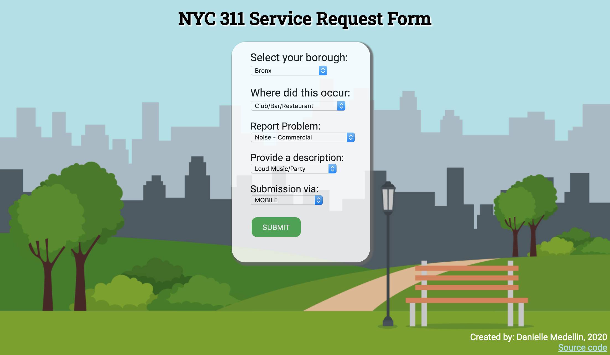

# NYC 311 Service Requests
#### Danielle Medellin [GitHub](https://github.com/dmedellin2)

### This Repo Includes:
- [1 - Data Gathering Notebook](./code/1_data_gathering_311.ipynb)  
- [2 - Service Request Models Notebook](./code/2_service_request_model.ipynb)  
- [Presentation Slides](./slides_and_instructions/dmedellin_service_request_project.pdf)  
- App Files:
    - [Instructions](./slides_and_instructions/app_instructions.pdf) 
    - [Version 1](app_glm.py)
    - [Version 2](app_ada.py)
    - [Pickled Models](./models)
    - [HTML Templates](./templates)
    - [CSS Style](./static/css)

## Problem Statement
According to the NYC311 online portal, "a Service Request is your request for the City to provide you with assistance, perform an inspection, or address a problem. NYC311 can accept Service Requests for a wide range of issues, including over 500 complaint types. Service Requests can help you get a pothole fixed in your neighborhood, the heat turned on in your apartment, or a refund for an overpaid parking ticket." Due to the fact that there are so many different reasons for submitting service requests to 311, all with a wide range of urgency and importance, it can be difficult to gauge how long it will take for a request to actually get resolved.

The NYC 311 receives millions of requests a year. In fact, in 2018 they received 3,154,013 service requests! [(Source)](https://www1.nyc.gov/311/311-sets-new-record-in-2018.page)

A citizen can submit a 311 request in various ways including by phone, online, or using mobile. If they do so with an email or a phone number, they will get a confirmation message which includes the details of the request. What is not included in this confirmation, is expected wait time until the request will be resolved and closed. Obviously, there are many factors that can affect one's wait time, but given the amount of 311 requests received, it should be possible to find trends in the wait times of these requests and give citizens, at the minimum, an estimate of how long they can expect to wait until their request is resolved. 

Our goal is to build a regression model that will predict the wait time a citizen can expect given the factors of their request. Our model's success will be measured with root-mean squared error (RMSE). Using RMSE allows us to look at our error in the same units as our target variable to get a good idea of our model's success.

Additionally, we hope to build an applet protoype that mimics what inputting a service request might look like, and in addition to just getting a description of the request, the app will also return an estimated wait time for the request to be closed.

## Executive Summary
Data was collected using the [NYC Open Data API](https://data.cityofnewyork.us/Social-Services/311-Service-Requests-from-2010-to-Present/erm2-nwe9). This database is updated daily with service requests from NYC 311. It currently holds 23 million observations each with 41 columns of information. We built a series of functions to collect recent data from this source through the API. 

After a few test runs of data collection, it was initially observed that there were many factors of what could affect the time it takes to resolve a service request. Looking at the most recent requests submitted, the overwheming majority of requests were sent to the New York City Police Department (NYPD). The NYPD responds to requests regarding noise, parking violations, trespassing, etc. The breadth of requests covered by the NYPD was considered varied enough to explore strictly requests from this one agency. 

Data was collected starting at Feb 1, 2020 and working backwards. Only observations that were sent to the NYPD and has a status of closed were considered. After discovering that 50,000 observations covered roughly a two week time span, we decided our goal was to collect about 6 months worth of data. This led us to collect the 600,000 most recent observations from our start date (Feb 1, 2020). Within our data collection we feature engineered our target variable of `waittime`, which was the difference in time from the `created_date` of a request to its `closed_date`. The data dictionary for the dataset can be found below.

### Data Dictionary
|Feature|Type|Description|
|---|:---:|:---|
|unique_key|int|Unique identifier of a Service Request (SR) in the open data set|
|created_date|datetime|Date and time when SR was submitted|
|closed_date|datetime|Date and time when SR was resolved and closed|
|agency|object|Acronym for agency which responds to the SR|
|agency_name|object|Which agency responds to the SR|
|complaint_type|object|The first level of a hierarchy identifying the topic of the incident or condition. Complaint Type may have a corresponding Descriptor or may stand alone.|
|descriptor|object|Associated to the Complaint Type, and provides further detail on the incident or condition. Descriptor values are dependent on the Complaint Type, and are not always required in SR.|
|location_type|object|Describes the type of location used in the address information|
|status|object|Status of SR at time of data collection. For the purpose of this project, only entries with status 'Closed' were collected|
|borough|object|Name of borough|
|open_data_channel_type|object|Indicates how the SR was submitted to 311.  i.e. By Phone, Online, Mobile, Other or Unknown|
|resolution_description|object|Describes the last action taken on the SR by the responding agency.  May describe next or future steps|
|resolution_action_updated_date|datetime|Date when responding agency last updated SR|
|latitude|float|Latitude in decimal degrees|
|longitude|float|Longitude in decimal degrees|
|waittime|float|Time elapsed from created date to closed date in days|

 This set of 600,000 observations was split into a training and holdout set of 540,000 and 60,000 observations respectively.

Once data was collected we performed data cleaning which involved giving each variable its appropriate data type, handling null values, and taking a closer look at our target variable. In our data exploration it was found that there were some negative wait times. This was unexpected, as it does not make sense for a request to take _negative_ time to complete. There were only 16 observations in our training set that had this issue, so they were dropped from the set. It was also found that the majority of requests were resolved in under one day. Despite this, there were some observations that had longer wait times spanning from 8 to 20 to 200 days. We decided that there should be a cut off for "reasonable" wait times, expecting that any request that takes over a month to resolve is not the norm. For this reason, we only looked at requests that had a wait time of 31 days or less. After this our training set had 539,312 observations. 

Further exploratory data analysis was performed as we explored how each of the key features affected wait time. The borough of the request was shown to have an affect on wait time as requests in the Bronx had the highest average wait time and those from Manhattan had the lowest. Of the top 10 most frequent complaint types, most had similar wait time averages. The complaint of _**Abandoned Vehicle**_ had the highest wait time average.

Before putting our chosen features into a model, we used $k$-modes clustering to potentially find similarities between the observations. We created 5 clusters and used these cluster categories as an additional feature. 

We tried many regression models including linear regression, decision trees, random forest, Gamma regression (GLM), and an AdaBoost model. Unfortunately, none of these models performed much better than our baseline model. 

We also attempted a time series model of order (0, 0, 1), or a MA(1) model using the `created_date` feature. This model looked at the average wait time of each day in our data set which decreased the sample size from almost 540,000 observations to just 249 observations. This model performed much better than the previous regression models stated above, but could not encapsulate the specifics of each observation as we desired. 

Moving forward, we used the GLM Gamma regression model to make predictions and evaluate our model. When looking at the coefficients of this model, it was found that the borough the request came from had the most variation in affect on wait time. Each cluster had similar affects on the target variable.

Finally, an app was created so that a user could simply visit the website, input the details of their request, and immediately receive an estimation of how long it will take for their request to be resolved. 
 
## Service Request Form Applet
   
Within this repo you'll find two versions of the Service Request Form app. Check [here](link) for instructions on how to use the app.

## Conclusions & Recommendations
Based on the performance of our models, it is clear that the features we looked at related to the context of the requests such as location, complaint type, and channel of request submission are not great predictors for how long it will take for a 311 service request to be resolved. The model that performed best took in only one feature and that was the date that the request was created. We cannot solely rely on that model because it looked at the average wait time by day and not individual requests as our other models did.

When we explored our GLM Gamma regression model more closely, it was found that the features which influenced wait time the most were those related to borough and cluster. Additionally, whether or not a submission was made via phone was significant as well. We saw the most variation of influence within the different boroughs. 

While location may be a possible indicator of wait time, using more specific location features than borough could lead to implicit associations with other factors such as race or socioeconomic status. 

Future projects would explore a time series model more deeply. A basic MA(1) model was a stronger predictor of wait time than our other regression models. By adding additional features to the time series model we could potentially improve the RMSE and overall performance of our model. 

The app could use improvements in performance, as location type should be specific for each complaint type as well, but is not currently set up that way. Therefore, submissions could be made that don't actually make sense such as a _**Noise - House of Worship**_ complaint occurring anywhere else besides a _House of Worship_. 

Next, we would look more deeply into some of the anomolies that occurred in the data. For example, we would explore any connections to the observations that had negative wait times, or outlier wait times of 200+ days. 

Being we did not anticipate to see negative wait times in our initial pull of the data, any request with a `created_date` that occurs after a `closed_date` has an incorrectly calculated wait time. In future iterations of this work we would correct that error. Being our model did not include observations with negative wait times, it did not affect the model itself. 

Lastly, we would extend this research to cover more types of service requests. We looked exclusively at those that are related to the NYPD agency. We would further improve our app by adding additional data from other agencies and service request types and either adding that to the current model, or making individual models for each agency. 

## References
[Ashish. “Bank Customer Clustering (K-Modes Clustering).”](www.kaggle.com/ashydv/bank-customer-clustering-k-modes-clustering.)
    
[“Getting Started with NYC OpenData and the Socrata API.”](holowczak.com/getting-started-with-nyc-opendata-and-the-socrata-api/5/.)  
    
[Johnson, Jesse. “K-Modes.”](shapeofdata.wordpress.com/2014/03/04/k-modes/.)

[JSFiddle.net](jsfiddle.net/7sntefum/.)  
    
[NYC OpenData. “311 Service Requests from 2010 to Present: NYC Open Data.”](data.cityofnewyork.us/Social-Services/311-Service-Requests-from-2010-to-Present/erm2-nwe9.)  
    
[NYC311. “About NYC311.”](www1.nyc.gov/311/311-sets-new-record-in-2018.page.)  
    
[Shadkam-Farrokhi, Mahdi. “ARIMA Review.”](git.generalassemb.ly/DSI-US-11/local_arima.)  
    
[Shadkam-Farrokhi, Mahdi. “Using cross_val_score with a Custom Metric.”](git.generalassemb.ly/DSI-US-11/local_faq/blob/master/code/custom_cross_val_score.ipynb.)  
    
[“Socrata Developer Portal.”](dev.socrata.com/foundry/data.cityofnewyork.us/erm2-nwe9.)  

[Xmunoz. “Xmunoz/Sodapy.”](github.com/xmunoz/sodapy/blob/master/examples/soql_queries.ipynb.)
